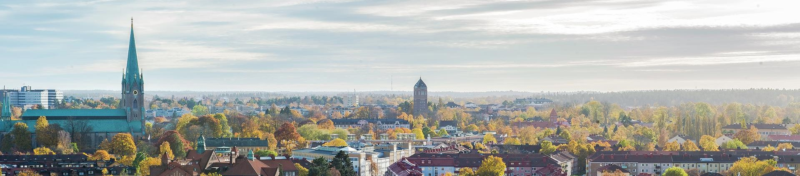

# Third Swedish Workshop on the Engineering of Systems-of-Systems
## Linköping, November 22 2018

| [Purpose](#purpose) | [Topics](#topics-of-interest) | [Participation](#participation-and-venue) | [Submission](#submission-guidelines) | [Program](#program) | [Proceedings](#proceedings) | [Organizers](#organizers) |

## Purpose

Systems-of-systems (SoS) is a topic of increasing importance as the digitalization of society accelerates. An SoS refers to a situation where a number of independent systems collaborate to create a value that they cannot achieve individually. 

The Swedish Workshop on the Engineering of Systems-of-Systems (SWESoS) has the primary purpose of creating a meeting place for researchers and practitioners interested in systems-of-systems. The workshop is an informal event, focusing on presentation of results and ongoing research, to stimulate interaction among researchers and practitioners. Following two successful events in [Stockholm (2015)](https://www.sics.se/events/1st-scandinavian-workshop-on-the-engineering-of-systems-of-systems-swesos-2015) and [Göteborg (2016)](http://swesos2016.github.io/), the third workshop in the series will be held in Linköping on November 22, 2018.

## Topics of interest

The scope of the workshop is all aspects related to systems-of-systems engineering. This includes, but is not restricted to, the following topics **when applied to systems-of-systems**:

- Architecture
- Autonomous and cooperative systems
- Business models, including software ecosystems
- Case studies of applications in different domains
- Control strategies
- Communication
- Dependability, robustness, and other quality attributes
- Enterprise architecture
- Governance
- Interoperability
- Modeling and simulation, including multi-agent systems
- Service oriented architecture
- Systems engineering methods
- Systems thinking

## Participation and venue

The workshop will take place at the Department of Computer Science, Linköping University, in room [Alan Turing](https://www.ida.liu.se/department/location/search.sv.shtml?keyword=alan+turing).

Participation is free of charge, except that participants may have to pay their own lunch. All participants (including presenters) need to [register](https://simplesignup.se/event/138267) for the workshop.

If you have any dietary restrictions, please contact the organizers.

## Submission guidelines

Researchers and practitioners interested in presenting at the conference should submit an extended abstract (500-1000 words) in English prior to the submission deadline. The proceedings will use [IEEE template](https://www.ieee.org/conferences/publishing/templates.html), so we highly recommend to apply this formatting already in the first submission. Papers should be submitted using [EasyChair](https://easychair.org/conferences/?conf=swesos2018).

The selection of contributions will be based on:

- Relevance to the workshop, i.e. how closely related to systems-of-systems engineering the submission is; 
- Interest to participants from a practical or theoretical perspective, i.e. including applicability, novelty, etc.; and 
- Quality of the text and content.

Note that there are no requirements on uniqueness, so it is possible to reuse or extend material that has already been presented elsewhere but that may not be known to a Swedish audience.

Each paper will be given a presentation slot of approximately 20 min. The conference language is English.

Important dates (all dates are firm, no extensions will be given):

- Oct. 19: Submission of extended abstract.
- Oct. 26: Notification of acceptance.
- Nov. 9: Final version of extended abstracts for inclusion in proceedings.
- Nov. 15: Final date for registrations.
- Nov. 22: Workshop.

## Program

The final program will be published end of October. It will consist of a few keynote presentations, participant presentations, and discussions. The preliminary duration is 9.00-17.00.

The following keynote presentations have been confirmed so far.

### Keynote: Towards a harmonized infrastructure for distributed simulation

__Abstract:__ Distributed simulation is more commonly seen as a very important tool to support activities ranging from research and design activities through test and verification of various systems to the training of system operators. 
The need to reuse components and take advantage of COTS technology and upcoming technologies coming from the gaming industry or other areas is becoming greater and greater as our requirement grow to represent more and more of the surrounding environment and have access to better visualization and analysis tools.

Within NATO the Science and Technology (STO) Organisation the Modelling and Simulation Group have been tasked with trying to standardize and approach to distributed simulation to enable NATO to take advantage of national training solutions and combine them into joint, larger scale exercise. An Architecture and Design framework have been agreed and published in the upcoming NATO STANREC 4800 and both the French and the UK government have larger simulation technology acquisition programs that refers to the standard.

Other areas are pursuing similar visions and the upcoming Space FOM is a good example that is currently supported and developed by NASA, ESA and the Russian Space Administration. Another example is ED147 RIM that is developed by the Air Traffic Management community.

This presentation aims to discuss commonalities between different approaches to standardised distributed simulation in various domain and how new tools are becoming available on the market as COTS solutions. 

__Presenter:__ Stefan Sandberg is the President of Pitch Technologies, the leading provider of innovative and standards based interoperability products and services. Before joining Pitch he has a long experience in working with flight simulators at Saab Aerosystems where he established a program to provide Mission Flight Simulators to all operators of the Gripen fighter aircraft. He has also managed a Swedish government IPT with the aim to coordinate all simulation resources and software development tools used in the development process for the Gripen Aircraft. He has served on the RAeS Flight Simulation Group Committee (FSGC) for a number of years and is active within SISO in the Executive Committee and SISO inc. Board of Directors. Stefan Sandberg has studied industrial Engineering and Management at the Linköping Institute of Technology and is a holder of a PPL flight certificate.

### Keynote: : SoS overview from SAAB, holistic process and challenges

__Presenter:__ Christopher Jouannet is a principal engineer of aircraft concept design at Saab Aeronautics. and also a senior lecturer at Linköping University. His research interests include model based design, system modelling and simulation, design optimisation, aircraft conceptual design, aerodynamics.

## Proceedings and presentations

The extended abstracts will be put into a proceedings document and published as a technical report. The presentations will be posted on this page.

## Organizers

General chair: Jakob Axelsson, RISE and Mälardalen University (jakob.axelsson (a) ri.se).

Organizing committee: To be added.
